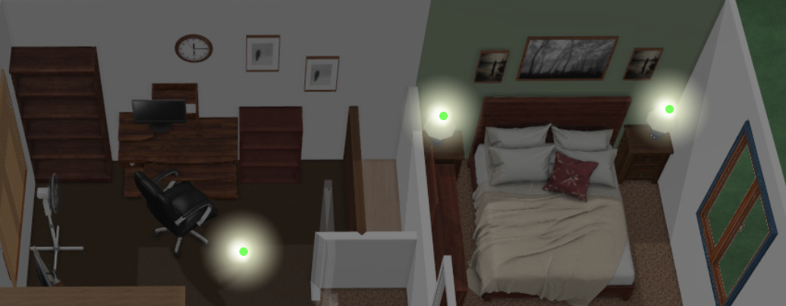

# Lesson 1 - install and basic switches
 

For this tutorial we're going to use a simple 3D floorplan image.  The same techniques would work fine with a 2D image, or any other 3D image you might have.   I've not used it, but it seems most people like a software called [sweet home 3d](http://www.sweethome3d.com/) for creating floor plans of their homes.  There is also [home by me](https://home.by.me/en/) or many other options available.  Use whatever you're most comfortable with.  

Anyway to keep things quick and basic images are supplied in this and future lessons. 

1.  Copy the tutorial folder containing 4 image files to your www folder (create if you don't have one)

	You should have:	 
	 * config/www/tutorial/base.jpg
	 * config/www/tutorial/dim.png
	 * config/www/tutorial/lite.png
	 * config/www/tutorial/liteoff.png
	 
	 
2.  Paste the text from [tutorial.yaml](https://github.com/bradcrc/color-lite-card/blob/master/tutorial/Lesson-1-Switches/Lesson-Files/tutorial.yaml) to the bottom of your ui-lovelace.yaml file.	 

3.  Edit the text so the sample lights (office_light, Left_lamp, Right_lamp) match real light entities in your HA setup. 

That's it.  

You now have a basic picture elements floor map, and should be able to turn the 3 lights on and off by clicking.

Click and hold a dot for the properties screen.
	

 
  
   
[Go on to Lesson 2](https://github.com/bradcrc/color-lite-card/tree/master/tutorial/Lesson-2-Room)
