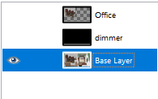
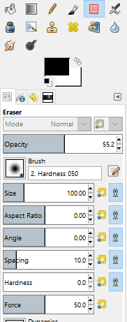
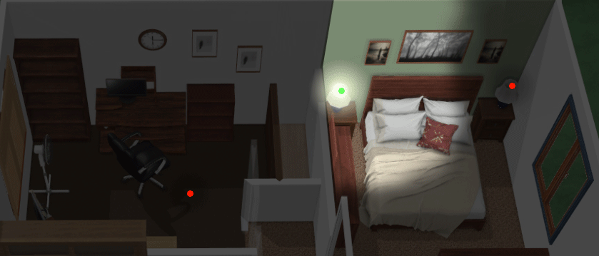

# Lamp Tutorial

Lets do a lamp.

1. Back in GIMP, let's select the base layer of our image

2. Use the lasso tool to copy a generous area around our middle lamp

3. Paste and hit the new layer button like you did in lesson 2 to create a new layer of just the lamp area.

4. That's nice, but ugly.  Lets clean it up a bit.   

5. Drag the pasted layer to the top.

6. Click the eye to show the base layer and the dimmer layer.

7. Find the eraser tool,  set the brush to 55% opacity, 100px size, 0.0 hardness.

8. Use the eraser to soften the edge of your pasted image away from the walls so it's very softly blended.  I find this is easiest if you show the base and dimmer layers below while editing.

9. De-select the other layers so you only see your selection.

10. **file > export as > lamp.png**

11. Copy your new lamp.png file to the tutorial folder.
 
 
12. Paste another copy of the same yaml as in lesson 2, but with the new entity name and image.  Remember: full screen images must come before clickable images in your .yaml file.

        - type: custom:color-lite-card
          entity: light.right_lamp
          tap_action:
            action: none    
          image:
            /local/tutorial/lamp.png   
          style:
            top: 50%
            left: 50%
            width: 100%    
			
			
Like the previous lesson,  click on the lamp to turn it on and off, and play with the dimming settings.

			

[On to Lesson 4](https://github.com/bradcrc/color-lite-card/tree/master/tutorial/Lesson-4-Color-Lamp)
